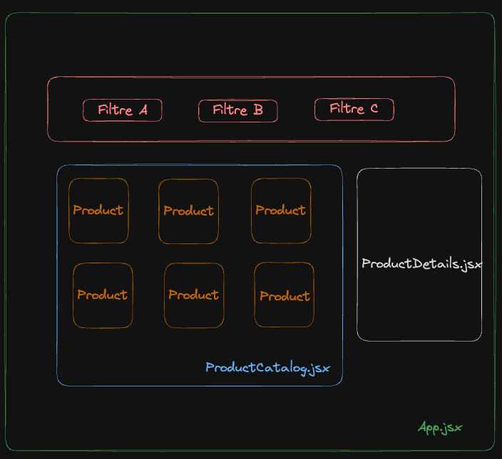

# LazyDev Shop: Le paradis du Développeur Feignant

Bienvenue dans le projet **LazyDev Shop**, une boutique e-commerce conçue spécialement pour les développeurs qui aiment travailler intelligemment, pas durement. Notre mission est de fournir des produits qui simplifient la vie des développeurs, les aidant à maximiser leur productivité avec le moins d'effort possible.

## Aperçu du Projet

Ce projet React vise à construire une boutique en ligne interactive où les utilisateurs peuvent explorer et acheter une sélection de produits destinés à faciliter la vie quotidienne des développeurs. En utilisant au minimum :

> - 4 composants React
> - Un tableau d'objets pour stocker les informations sur les produits
> - Des props
> - Des states pour filtrer et afficher les produits

les développeurs vont créer une application web dynamique et réactive.

Un exemple de tableau de données :

```javascript
    const products = [
        {
            name: "...",
            image: "...",
            price: "...",
            category: "..."
        }
        ...
    ]
```

Vous pouvez également vous challenger en stockant ces informations en format `JSON`dans le dossier `assets/data`.

## Fonctionnalités Clés

- **Catalogue de Produits**: Affichez tous les produits disponibles à l'aide d'un composant React qui mappe chaque produit à une carte produit.
- **Filtre de Produits**: Permettez aux utilisateurs de filtrer les produits selon différentes catégories (ex: gadgets, livres, vêtements) en utilisant les states et les props pour gérer les interactions utilisateur.
- **Détails du Produit**: Offrez une vue détaillée pour chaque produit où les utilisateurs peuvent lire plus d'informations, en utilisant un composant dédié qui reçoit les données du produit via des props.

## Structure du Projet

- `src/`
  - `components/` : Dossier contenant tous les composants React.
    - `Product.jsx` : Composant pour afficher UN produit.
    - `ProductCatalog.jsx` : Composant pour afficher le catalogue de produits.
    - `ProductFilter.jsx` : Composant pour filtrer les produits par catégorie.
    - `ProductDetails.jsx` : Composant pour afficher les détails d'un produit spécifique.
  - `App.jsx` : Le composant racine qui assemble tous les autres composants.

> Vous pouvez également ajouter vos propres composants tels que `Navbar` ou `Footer` par exemple.

## Suggestion de présentation



> Cette image est une simple suggestion, libre à vous de concevoir une proposition différente à condition d'avoir les composants requis.

## Deadline

⚠️ Mardi 03/04/2024 11h30 !

Bon courage !
